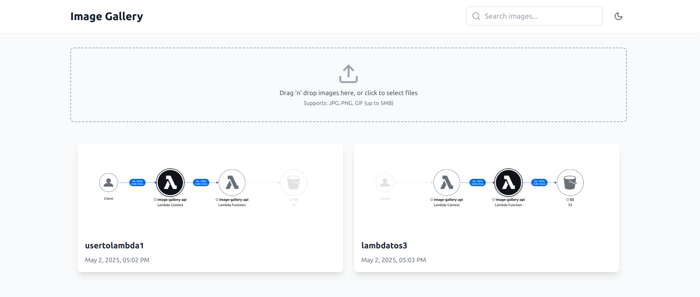

# Modern Image Gallery


A sleek, modern image gallery application built with React, TypeScript, and AWS services. Upload, view, and manage your images with a clean and intuitive interface.

<p align="center">  </p>

## Features

- Drag-and-drop image uploads
- Responsive image grid layout
- Secure image storage with AWS S3
- Real-time upload progress tracking
- Modern UI with Tailwind CSS

## Branches

This project has three main branches, each showcasing different architectural approaches:

### `main` - S3 Direct Integration

The main branch implements a frontend-only application that interacts directly with AWS S3 for image storage and retrieval. Perfect for simple use cases where a backend isn't necessary.

### `rds_feature` - Full-Stack with Database

The `rds_feature` branch extends the application with a backend server that manages interactions between the frontend, AWS S3, and a relational database. This architecture enables additional features like:

- Image metadata storage
- Advanced search and filtering
- Image categorization

### `xray_lambda` - Serverless with AWS Lambda

The `xray_lambda` branch implements a serverless architecture using:

- AWS Lambda functions as the backend
- AWS X-Ray for distributed tracing and performance monitoring
- API Gateway for secure API endpoints
- Optimized for cost and scalability

## Containerization

- Each branch's application is containerized using Docker for streamlined deployment and consistency.

## Getting Started

1. Clone the repository
2. Configure AWS credentials in `.env` file
3. Install dependencies with `npm install`
4. Start the development server with `npm run dev`

## Environment Setup

Create a `.env` file in the project root with your AWS credentials:

```
VITE_AWS_REGION=your-region
VITE_AWS_ACCESS_KEY_ID=your-access-key
VITE_AWS_SECRET_ACCESS_KEY=your-secret-key
VITE_AWS_BUCKET_NAME=your-bucket-name
```

## License

MIT
