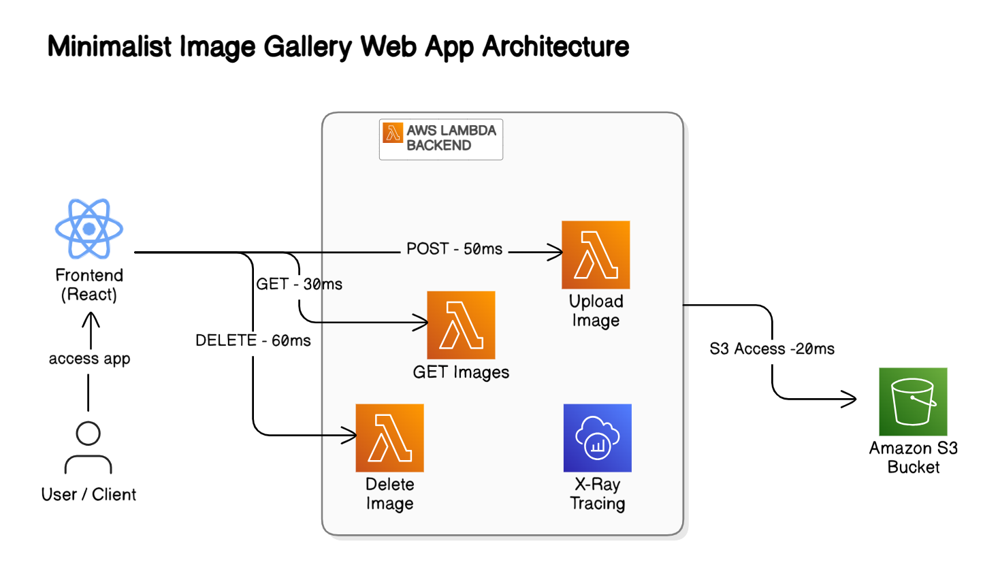
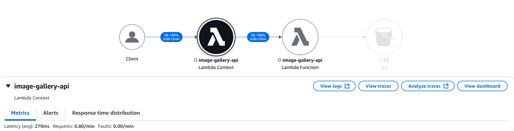
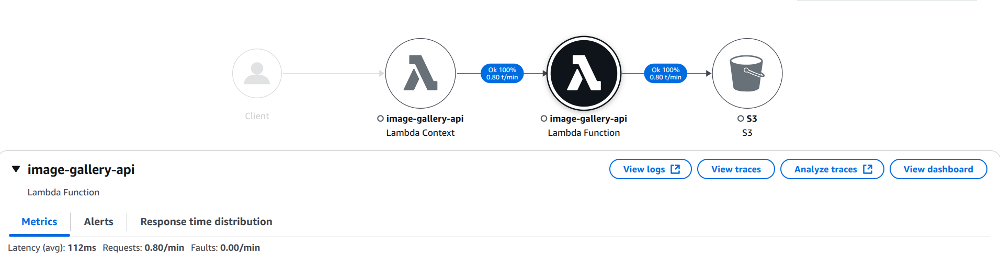

# 𝗧𝗿𝗮𝗰𝗶𝗻𝗴 𝗮𝗻𝗱 𝗢𝗯𝘀𝗲𝗿𝘃𝗶𝗻𝗴 𝗔𝗽𝗽𝗹𝗶𝗰𝗮𝘁𝗶𝗼𝗻𝘀 𝘄𝗶𝘁𝗵 𝗔𝗪𝗦 𝗫-𝗥𝗮𝘆

A modern image gallery application with distributed tracing capabilities, demonstrating observability best practices using AWS X-Ray.

## Project Overview

This project implements a serverless image gallery with comprehensive tracing to visualize and monitor application performance. Users can upload, view, and delete images through a responsive React frontend, while the backend operations are traced using AWS X-Ray for complete visibility into the request flow.

### Architecture

<p align="center">  </p>

The application consists of:

- **Frontend**: React application for image management
- **Backend**: AWS Lambda functions with X-Ray tracing
  - GET function: Lists all images from S3
  - POST function: Uploads new images to S3
  - DELETE function: Removes images from S3
- **Storage**: Amazon S3 bucket for image files
- **Infrastructure**: Terraform for IaC (Infrastructure as Code)

## Features

- Upload images with custom titles
- View gallery of uploaded images
- Delete unwanted images
- Comprehensive request tracing with AWS X-Ray
- Visualize performance metrics and bottlenecks
- Infrastructure as Code with Terraform

## X-Ray Tracing Benefits

- Complete visibility into request flow
- Performance monitoring for each operation
- Bottleneck identification
- Error tracing and troubleshooting
- Service dependency mapping

## Project Structure

```
/
├── src/                    # React frontend code
│   ├── components/         # React components
│   ├── services/           # Service integrations (S3, Lambda)
│   └── App.tsx             # Main application component
├── tf-lambda/              # Terraform configuration
│   ├── lambda-handler.js   # Lambda function code
│   ├── main.tf             # Main Terraform configuration
│   ├── variables.tf        # Terraform variables
│   └── outputs.tf          # Terraform outputs
└── docs/                   # Documentation and screenshots
    ├── architecture.png    # Architecture diagram
    └── trace-map.png       # X-Ray trace map screenshots
```

## Prerequisites

- AWS CLI configured with your credentials
- Terraform installed
- Node.js and npm installed
- An AWS account with appropriate permissions

## Deployment

### Backend Deployment

1. Navigate to the Terraform directory:

   ```bash
   cd tf-lambda
   ```

2. Initialize Terraform:

   ```bash
   terraform init
   ```

3. Apply the Terraform configuration:

   ```bash
   terraform apply
   ```

4. Note the Lambda Function URL from the outputs

### Frontend Configuration

1. Create a `.env` file in the project root with the following variables:

   ```
   VITE_AWS_REGION=your-region
   VITE_AWS_BUCKET_NAME=your-bucket-name
   VITE_LAMBDA_FUNCTION_URL=your-lambda-function-url
   ```

2. Install dependencies and start the development server:
   ```bash
   npm install
   npm run dev
   ```

## Observing Traces

1. Access the AWS X-Ray console in your AWS account
2. Navigate to the Trace Map view to see the visualization of requests
3. Click on individual traces to see detailed timing information
4. Explore service dependencies and performance metrics

## Screenshots

### User to Lambda

<p align="center">  </p>

### Lambda to s3

<p align="center">  </p>

## License

MIT

1. **Create the X-Ray SDK Layer**:

   ```bash
   ./create-xray-layer.sh
   ```

   This will create the `xray-layer.zip` file needed for the Lambda deployment.

2. **Configure your deployment**:
   Copy `terraform.tfvars.example` to `terraform.tfvars` and fill in your AWS credentials and S3 bucket name:

   ```
   # AWS credentials
   aws_region     = "eu-west-1"
   aws_access_key = "YOUR_AWS_ACCESS_KEY"
   aws_secret_key = "YOUR_AWS_SECRET_ACCESS_KEY"

   # S3 bucket configuration
   s3_bucket_name = "your-s3-bucket-name"
   ```

3. **Deploy the Lambda function**:

   ```bash
   terraform init
   terraform apply
   ```

4. **Get the Lambda Function URL**:
   After deployment, Terraform will output the Lambda function URL. Use this URL in your frontend application.

## Frontend Integration

1. **Update your `.env` file** to include the Lambda Function URL:

   ```
   VITE_LAMBDA_FUNCTION_URL=https://your-lambda-function-url.lambda-url.eu-west-1.on.aws
   ```

2. **The S3 service has been updated** to use the Lambda function URL for all operations (list, upload, delete).

## Testing the Deployment

1. After deploying the Lambda function, run your frontend application:

   ```bash
   cd ..
   npm run dev
   ```

2. Upload an image and verify that it's processed through the Lambda function.

3. Check AWS CloudWatch Logs and X-Ray traces to monitor the Lambda function execution.

## Troubleshooting

- **CORS Issues**: If you encounter CORS errors, verify that the Lambda function has the correct CORS headers in the response.
- **Lambda Errors**: Check CloudWatch Logs for any errors in the Lambda function execution.
- **X-Ray Tracing**: View X-Ray traces in the AWS Console to diagnose performance issues.
